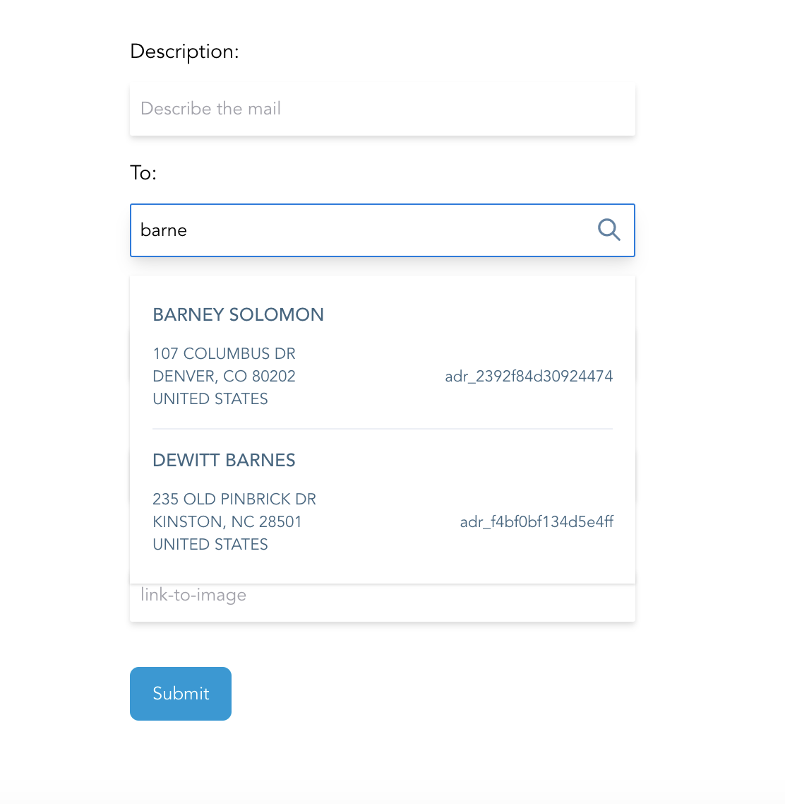
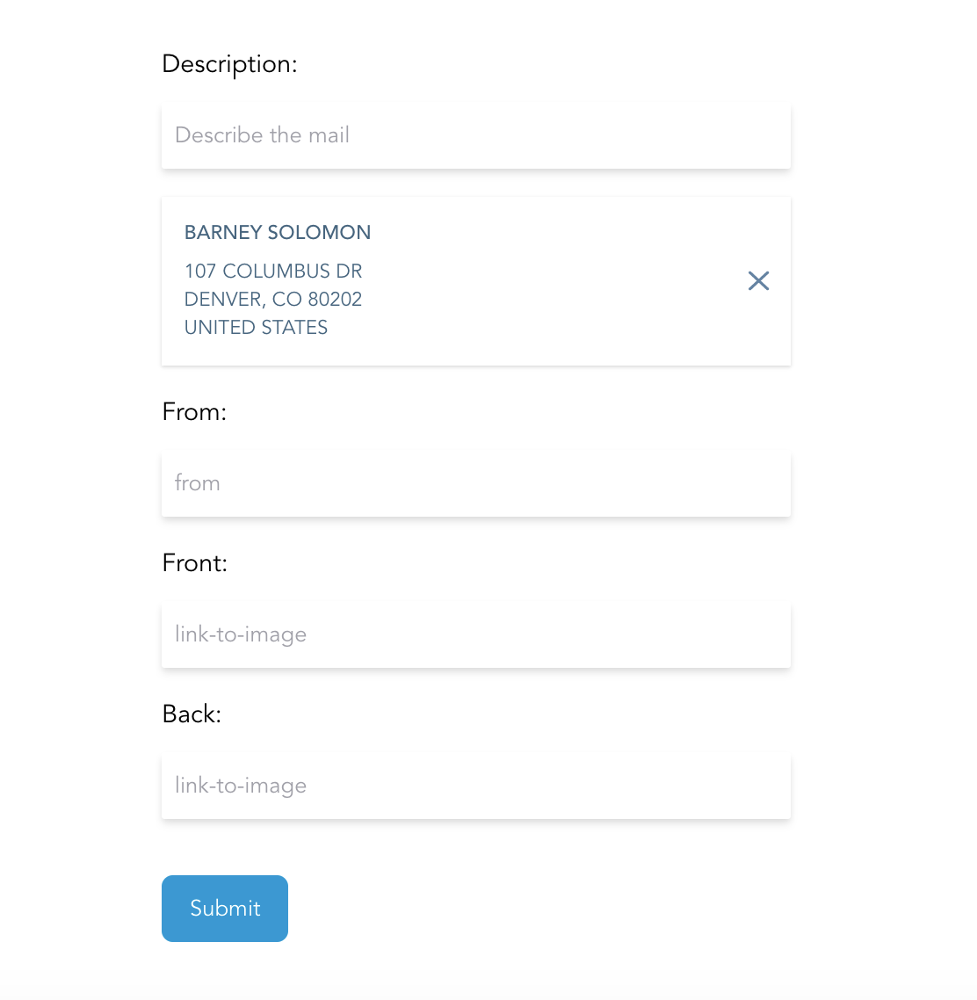

## a postcard form

### overview

When users are using the dashboard, they want an easy way to access previously-created addresses in their account.
This is a dashboard shell with a postcard form. The form allows the users to search through their existing addresses and pick one to use.

### ⫸ [demo here](https://postcard-form.vercel.app/)

### screenshots

### built with
- Vue 3
- TypeScript
- Tailwind CSS
### run locally

##### <a href="https://pnpm.js.org/en/installation">get pnpm</a> _(or use npm or yarn)_

`npm install -g pnpm`

##### install dependencies

`pnpm i`

##### run

`pnpm run dev`

#### manual testing info

example names to search for, provided by the test api:

- SILAS KERR, BRETT VARGAS, MEL BARRON, ADRIANA GLASS, DOUGLAS MONTGOMERY, WILFREDO RYAN, PATTI MICHAEL, BARNEY SOLOMON, ELAINE WADE, KATIE WILKERSON

#### next steps
- smoother transitions
- limit results (?)
- adjust the UI to mobile/tablet views
